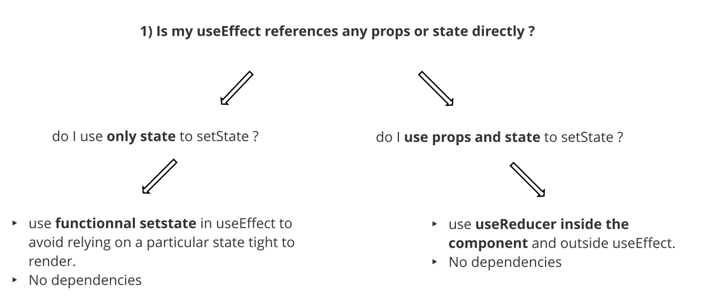
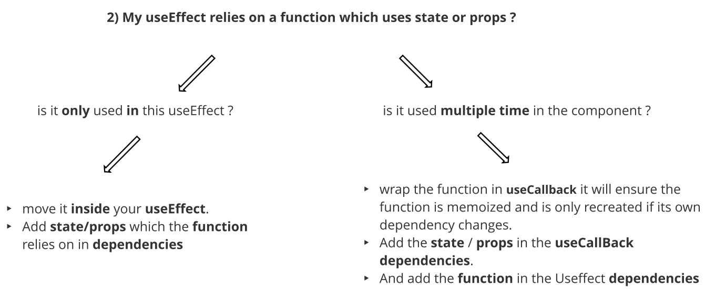
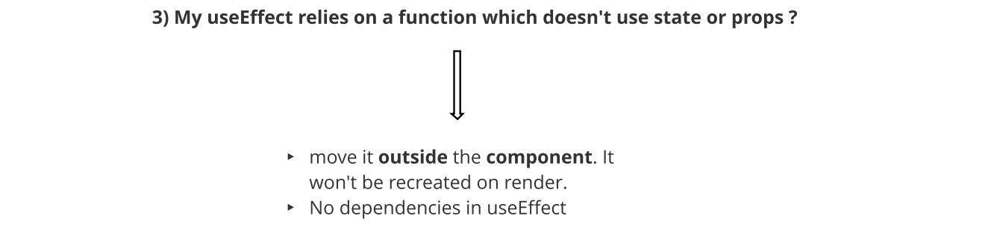

Disclaimer : All the content here is a mix summary from <https://overreacted.io/a-complete-guide-to-useeffect/> from Dan Abramov and <https://reactjs.org/docs/hooks-faq.html#is-it-safe-to-omit-functions-from-the-list-of-dependencies> I strongly recommend you to read them integrally for a full understanding of `UseEffect`

`UseEffect ` is used when you want to tell your component to do something after it renders — as  we typically want to perform our effects *after* React has updated the DOM.

It replaces the lifecycle method from class. 

Below is the full signature

```javascript
useEffect(() => {  
  doSomething() //side effect to do each time useEffect run
  return () => cleanUpDoSomething; // if a return value is provided, it will be called when component unmount or if a render run a new useEffect (the previous render useeffect cleanup)
}, [dep]); //dependencies which help react decides when to run useEffect. if dep.previous render !== dep.currentRender => run useEffect 
```


This structure has some major implications on where to declare your functions used in a useEffect as well as what to put in dependencies. 

Here is a mental model to help you navigate the different use cases :










Side Note : 

> You may omit dispatch, setState, and useRef container values from the deps because React guarantees them to be static. But it also doesn’t hurt to specify them


